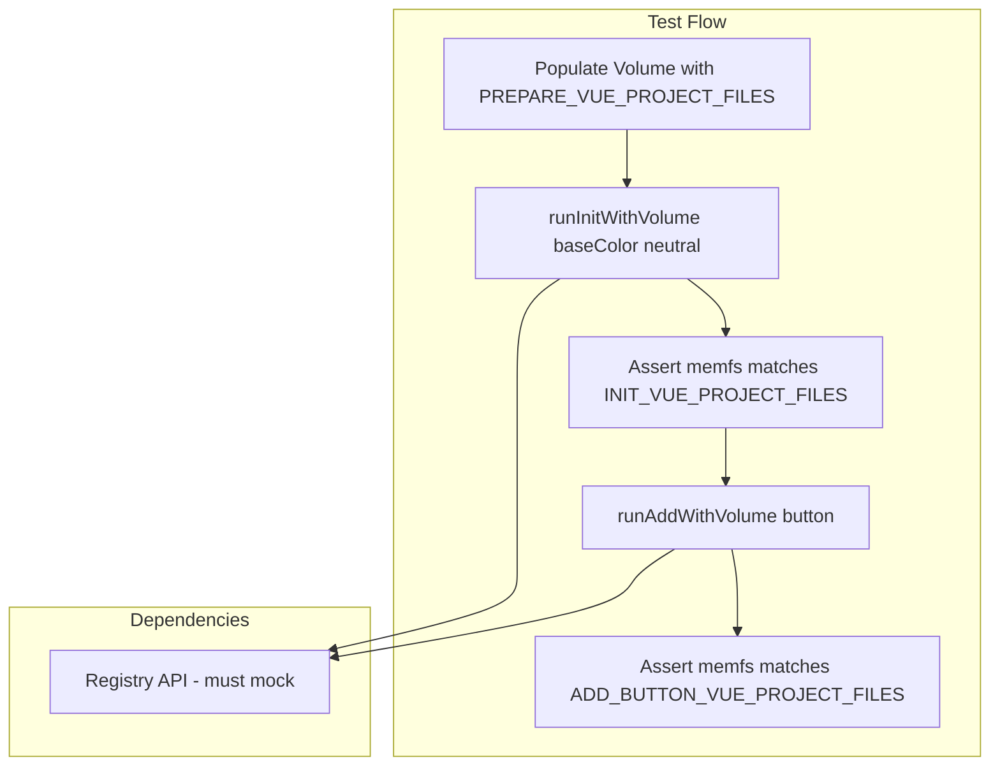

# Browser Memfs Test Suite Plan

## Context Summary

The user has documented four project states:

- **Initial**: `initialViteVueProject.ts` - Vanilla Vite + Vue scaffold
- **Prepare**: `prepareViteVueProject.ts` - Tailwind v4, @ alias, `@import "tailwindcss"` (ready for init)
- **After init**: `initViteVueProject.ts` - components.json, src/lib/utils.ts, CSS variables (Neutral), new deps
- **After add button**: `addButtonInViteVueProject.ts` - Button.vue, button index.ts, reka-ui

The browser demo uses [useMemfs.ts](examples/fs-vite-browser/src/composables/useMemfs.ts) which calls [runInitWithVolume](src/browser/run-init.ts) and [runAddWithVolume](src/browser/run-add.ts) from `uni-cn/browser`. Both use `MemFileSystem` and `silent: true` / `skipPreflight: true`.

## Architecture

## Implementation Plan

### Phase 1: Test Infrastructure Setup

1. **Create test directory and helper**
  - Add `test/browser-memfs/init-add.test.ts`
  - Create `test/browser-memfs/helpers.ts` with:
    - `populateVolume(vol: Volume, root: string, files: Record<string, string>)` - writes all entries to memfs
    - `assertVolumeMatches(vol: Volume, root: string, expected: Record<string, string>)` - compares key files (skip svg/binary if needed)
2. **Import data from examples**
  - Import `PREPARE_VUE_PROJECT_FILES`, `INIT_VUE_PROJECT_FILES`, `ADD_BUTTON_VUE_PROJECT_FILES` from `examples/fs-vite-browser/src/data/`
  - Vitest root is project root; use relative paths: `../../examples/fs-vite-browser/src/data/...`
3. **Registry mocking**
  - Init fetches: `getRegistryBaseColor` (base color CSS vars), `getRegistryItem` (style "index" for new-york)
  - Add fetches: `getRegistryItem` for "button" component
  - Use `vi.mock('@/registry/api')` or MSW to return fixtures matching what the real registry provides for Neutral + new-york + button
  - Reference: [test/commands/init.test.ts](test/commands/init.test.ts) mocks `getRegistryBaseColor` and `getRegistryItem`

### Phase 2: File Content Assertions

1. **Test: prepare -> init -> file snapshot**
  - Populate Volume with `PREPARE_VUE_PROJECT_FILES` at `/project`
  - Call `runInitWithVolume(vol, '/project', buildMemfsConfig('/project', { ...defaultMemfsRawConfig, tailwind: { ...baseColor: 'neutral' } }))`
  - Assert critical files match `INIT_VUE_PROJECT_FILES`:
    - `components.json`, `package.json`, `src/style.css`, `src/lib/utils.ts`, `tsconfig*.json`, `vite.config.js`
  - Use `assertVolumeMatches` to compare; for JSON/files with potential minor formatting differences, normalize before compare (e.g. parse+stringify for package.json)
2. **Test: init result -> add button -> file snapshot**
  - Populate Volume with `INIT_VUE_PROJECT_FILES` at `/project`
  - Call `runAddWithVolume(vol, '/project', ['button'], buildMemfsConfig('/project'))`
  - Assert:
    - `src/components/ui/button/Button.vue` and `src/components/ui/button/index.ts` exist and match `ADD_BUTTON_VUE_PROJECT_FILES`
    - `package.json` includes `reka-ui` and matches expected

### Phase 3: Log Verification (Optional Enhancement)

1. **Log capture strategy**
  - Currently `runInitWithVolume` uses `silent: true`; ora output is suppressed.
  - Options:
    - **A**: Add optional `onLog?: (msg: string) => void` to `runInitWithVolume` / `runAddWithVolume`; inject a logger that init/add services call (requires refactor of init/add to accept logger)
    - **B**: Run with `silent: false` and `vi.spyOn(process.stdout, 'write')` - fragile due to ora cursor/clear
    - **C**: Defer log assertions; document as follow-up
  - **Recommendation**: Implement **C** for initial scope; add a TODO for Phase 3 log capture. If the user strongly needs logs, implement **A** by adding an optional `ILogger` service to the DI container that init/add use when provided.

### Phase 4: UseMemfs and Demo Alignment

1. **Ensure useMemfs prepare step exists**
  - [useMemfs.ts](examples/fs-vite-browser/src/composables/useMemfs.ts) uses `INITIAL_PROJECT_FILES` in `ensureProject()`. The real node flow expects PREPARE state before init.
  - Add `prepareForInit()` (or similar) that overwrites project files with `PREPARE_VUE_PROJECT_FILES` so users can "prepare" before running init in the demo.
  - Wire a "Prepare for Init" button in InitExample.vue that calls this before init.
2. **useMemfs baseColor**
  - [useMemfs.ts](examples/fs-vite-browser/src/composables/useMemfs.ts) defaults to `baseColor: 'zinc'`; [InitExample.vue](examples/fs-vite-browser/src/examples/InitExample.vue) allows selecting `neutral`. Ensure the test uses `baseColor: 'neutral'` to match `initViteVueProject.ts`.

### Key Files

| File                                                                         | Purpose                                      |
| ---------------------------------------------------------------------------- | -------------------------------------------- |
| [src/browser/run-init.ts](src/browser/run-init.ts)                           | Entry for init; pass baseColor via rawConfig |
| [src/browser/run-add.ts](src/browser/run-add.ts)                             | Entry for add                                |
| [src/browser/config.ts](src/browser/config.ts)                               | `defaultMemfsRawConfig`, `buildMemfsConfig`  |
| [examples/fs-vite-browser/src/data/*.ts](examples/fs-vite-browser/src/data/) | Expected file content snapshots              |

### Registry Mock Fixtures

Create `test/fixtures/registry/` with:

- `neutral-base-colors.json` - response for `getRegistryBaseColor('neutral')` (CSS variables for neutral)
- `new-york-style.json` - response for `getRegistryItem` style index
- `button.json` - response for `getRegistryItem` button component (files, dependencies)

These should match the structure returned by the real shadcn-vue registry. Use `vi.mock` + `vi.mocked().mockResolvedValue` to return these.

## Execution Order

1. Add `test/browser-memfs/helpers.ts` and `test/browser-memfs/init-add.test.ts`
2. Add registry mocks using existing registry schema from [src/registry/](src/registry/)
3. Implement prepare -> init test; fix any mismatches (e.g. baseColor in config)
4. Implement init -> add button test
5. Add `prepareForInit` to useMemfs and "Prepare for Init" in InitExample (optional UX improvement)
6. Document log verification as follow-up

