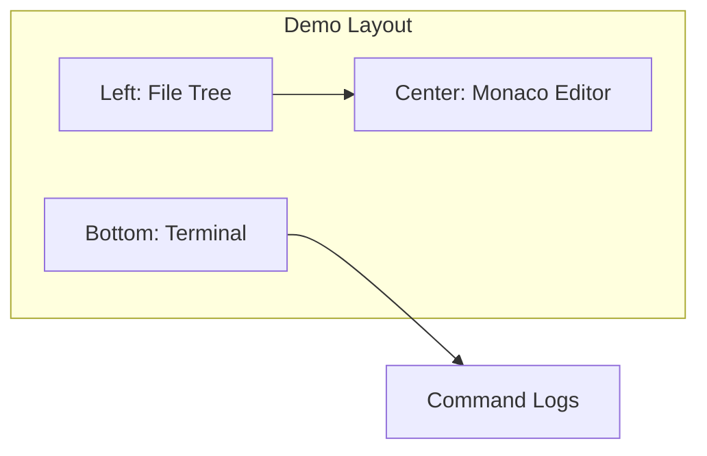

# CodeSandbox-like Browser Demo Enhancement

## Current State

The `[examples/fs-vite-browser/](examples/fs-vite-browser/)` demo has:

- Tabs: Init, Create
- Form-based UI with JSON output
- memfs-backed execution via `runInitWithVolume`, `runCreateWithVolume`, `runAddWithVolume` (from `uni-cn/browser`)
- No file explorer, no code editor, no terminal

## Target Layout (CodeSandbox-like)




- **Left sidebar**: Collapsible file tree built from memfs (`vol.readdirSync` recursively), filtered by project root (e.g. `/project`)
- **Center**: Monaco editor to view/edit selected file content; edits write back to memfs
- **Bottom**: Simulated shell terminal (xterm.js) showing command execution logs
- **Top tabs**: Init | Create | Add (new)

## Dependencies to Add


| Package                                                        | Purpose                                  |
| -------------------------------------------------------------- | ---------------------------------------- |
| `monaco-editor`                                                | Core editor (peer of monaco-editor-vue3) |
| `monaco-editor-vue3`                                           | Vue 3 wrapper with CodeEditor component  |
| `vite-plugin-monaco-editor` or `vite-plugin-monaco-editor-esm` | Vite worker bundling                     |
| `xterm`                                                        | Terminal emulator for log display        |
| `xterm-addon-fit`                                              | Auto-resize terminal to container        |


## Key Implementation Details

### 1. Shared State and Layout

- Introduce a **shared memfs Volume** and **project root** across Init/Create/Add tabs
- Layout: `display: grid` or flex with three regions (sidebar | main | terminal)
- Sidebar width ~200–240px; terminal height ~180px; editor fills remaining space

### 2. File Tree from memfs

- Use `vol.readdirSync(path, { withFileTypes: true })` recursively (as in [verify.ts](examples/fs-memfs-vue/verify.ts)) to build a tree
- Filter to project root (e.g. `/project`) to avoid `/` clutter
- Tree nodes: folders expandable, files clickable to open in Monaco
- Tree updates after each successful Init / Create / Add run (use `computed`/`watch` on `vol`)

### 3. Monaco Editor

- Use `CodeEditor` from `monaco-editor-vue3` with `v-model:value`
- Language: derive from file extension (`.vue`→`html`, `.ts`→`typescript`, `.json`→`json`, `.css`→`css`)
- On change: `vol.writeFileSync(selectedPath, newValue)` to persist back to memfs
- Vite: add `vite-plugin-monaco-editor` with languages `['json','typescript','javascript','html','css']` to limit bundle size
- Theme: `vs-dark` to match existing dark UI

### 4. Terminal (xterm.js)

- Mount xterm in a fixed-height container; use `FitAddon` for resize
- **Log capture strategy**: Run commands with `silent: false` and patch `consola` before invoking `runInitWithVolume` / `runAddWithVolume` to push logs to an array; write each line to xterm via `terminal.writeln()`
- Alternative (simpler): Wrap calls in try/catch and manually `terminal.writeln()` messages like `$ npx uni-cn init`, `Running init...`, `Done.`; on error, write `Error: ${err.message}`
- Clear terminal on each new command run
- Optional: use `xterm`'s `linkifier` for clickable paths in errors

### 5. Add Tab

- **Flow**: Init must run first (creates `components.json`). Add requires an initialized project.
- Form: component selector (multiselect or comma-separated input), e.g. `button`, `card`, `input`
- On submit: call `runAddWithVolume(vol, root, components, buildMemfsConfig(root, rawConfig))`
- Use `defaultMemfsRawConfig` + `buildMemfsConfig` from `uni-cn/browser`
- Pre-populate `package.json` and project structure if empty (same as Init tab)
- Optionally fetch registry index and show available components in a dropdown (if `/api/registry` proxy works)

### 6. Init/Create Integration

- Both Init and Create already use `vol` and `root`; after success, update the shared state so:
  - File tree reflects new files
  - Terminal shows logs
- Prefer a single shared `vol` ref that persists across tab switches

## File Structure (New/Modified)

```
examples/fs-vite-browser/
  src/
    components/
      FileTree.vue       # Recursive tree from vol
      MonacoEditor.vue    # Wrapper around CodeEditor
      TerminalLog.vue     # xterm.js container
    composables/
      useMemfs.ts        # Shared vol, root, runInit, runAdd, runCreate, logCapture
    examples/
      InitExample.vue    # Refactor: use useMemfs, emit to terminal
      CreateExample.vue  # Same
      AddExample.vue     # New: init-if-needed + add flow
    App.vue              # New layout: sidebar | content (tabs + editor) | terminal
  vite.config.ts         # Add monaco plugin
  package.json           # Add monaco-editor, monaco-editor-vue3, xterm, xterm-addon-fit, vite-plugin-monaco-editor
```

## Error Handling and Iteration

- Wrap all command invocations in `try/catch`; on error, write to terminal and show error in UI
- Common issues to expect: Monaco worker path resolution, xterm CSS, memfs path normalization, CORS for registry in Add
- Plan assumes iterative fixes: run `pnpm dev`, test each tab, fix any console/runtime errors until Init, Create, and Add all work with the new layout

## Vite Config Updates

- Add `vite-plugin-monaco-editor` (or `-esm`) to `plugins`
- Optionally add `MonacoEnvironment.getWorker` in `index.html` if workers fail
- Ensure Monaco CSS is loaded (plugin usually handles this)

## Suggested Order of Implementation

1. Add dependencies, configure Vite for Monaco
2. Create layout shell (App.vue): sidebar placeholder, tab area, terminal placeholder
3. Implement `useMemfs` composable with shared `vol`, `root`, and basic run wrappers
4. Implement `FileTree.vue` using `vol.readdirSync` recursively
5. Implement `MonacoEditor.vue` with file path ↔ content sync to/from memfs
6. Implement `TerminalLog.vue` with xterm.js and log buffer
7. Wire log capture: patch consola or use manual log lines before/after each run
8. Refactor InitExample and CreateExample to use layout and shared state
9. Add AddExample.vue with init-then-add flow
10. Fix any runtime errors iteratively (Monaco workers, terminal sizing, path handling, etc.)

